## Prelude: Slope and Rate of Change

The slope of a linear function measures how quickly its value rises or falls as its inpul value changes.
Graphically, this is measured as the change in vertical distance when moving from left to right along the line's graph.
Intuitively, you may be familial with the "rise over run" definition.
Slopes are often fractions because of their definition, comparing (dividing) one amount of change by another.
The graph below shows algebraic definition.

  <noscript></noscript>

It measures the *rate of change* of the y-coordinate with respect to changes in
the x-coordinate. If the line represents the distance traveled
over time, for example, then its slope represents the
velocity. In the figure, you can remind yourself of how we
calculate slope using two points on the line:
x
y
x
x
y
y
m
∆
∆
=
−
−
=
=
=
1
2
1
2
run
rise
Q
to
P
from
slope
We would like to be able to get that same sort of information (how fast the curve rises or falls,
velocity from distance) even if the graph is not a straight line. But what happens if we try to find
the slope of a curve at a point, as in the figure below? We need two points in order to determine
the slope of a line. How can we find a slope of a curve, at just one point?
The answer, as suggested in the figure, is to find the slope of the
tangent line to the curve at that point. Most of us have an intuitive
idea of what a tangent line is. Unfortunately, “tangent line” is hard to
define precisely.
Definition: A secant line is a line between two points on a
curve, as in the figure to the right.
Can’t-quite-do-it-yet Definition: A tangent line is a line at one
point on a curve …. that does its best to be the curve at that
point?
As you may be able to see, the closer the point Q is to the point P,
the closer the secant slope gets to the tangent slope. This will be
key to finding the tangent slope, but first we need to more carefully
define the idea of "getting closer to."

## Definition of the Derivative

Suppose we drop a tomato from the top of a 100 foot building and time its fall.
Some questions are easy to answer directly from the table:
(a) How long did it take for the tomato n to drop 100 feet?
(2.5 seconds)
(b) How far did the tomato fall during the first second?
(100 – 84 = 16 feet)
(c) How far did the tomato fall during the last second?
(64 – 0 = 64 feet)
(d) How far did the tomato fall between t =.5 and t = 1?
(96 – 84 = 12 feet)
Some other questions require a little calculation:
(e) What was the average velocity of the tomato during its fall?
Average velocity = distance fallen
total time
=
∆ position
∆ time = –100 ft
2.5 s = –40 ft/s .
(f) What was the average velocity between t=1 and t=2 seconds?
Average velocity = ∆ position
∆ time =
36 ft – 84 ft
2 s – 1 s = –48 ft
1 s = –48 ft/s .
Some questions are more difficult.
(g) How fast was the tomato falling 1 second after it was dropped?
This question is significantly different from the previous two questions about average velocity.
Here we want the instantaneous velocity, the velocity at an instant in time. Unfortunately the
tomato is not equipped with a speedometer so we will have to give an approximate answer.
One crude approximation of the instantaneous velocity after 1 second is simply the average
velocity during the entire fall, –40 ft/s . But the tomato fell slowly at the beginning and
rapidly near the end so the "–40 ft/s" estimate may or may not be a good answer.
Time (sec)
Height (ft)
0.0
100
0.5
96
1.0
84
1.5
64
2.0
36
2.5
0
Chapter 2 The Derivative
Applied Calculus
81
We can get a better approximation of the instantaneous velocity at t=1 by calculating the
average velocities over a short time interval near t = 1 . The average velocity between t = 0.5
and t = 1 is –12 feet
0.5 s = –24 ft/s, and the average velocity between t = 1 and t = 1.5 is
–20 feet
.5 s
= –40 ft/s so we can be reasonably sure that the instantaneous velocity is between –
24 ft/s and –40 ft/s.
In general, the shorter the time interval over which we
calculate the average velocity, the better the average
velocity will approximate the instantaneous velocity.
The average velocity over a time interval is ∆ position
∆ time ,
which is the slope of the secant line through two points
on the graph of height versus time. The instantaneous
velocity at a particular time and height is the slope of the
tangent line to the graph at the point given by that time
and height.
Average velocity = ∆ position
∆ time = slope of the secant line through 2 points.
Instantaneous velocity = slope of the line tangent to the graph.
GROWING BACTERIA
Suppose we set up a machine to count the
number of bacteria growing on a Petri plate. At
first there are few bacteria so the population
grows slowly. Then there are more bacteria to
divide so the population grows more quickly.
Later, there are more bacteria and less room and
nutrients available for the expanding population,
so the population grows slowly again. Finally,
the bacteria have used up most of the nutrients,
and the population declines as bacteria die.
Chapter 2 The Derivative
Applied Calculus
82
The population graph can be used to answer a number of questions.
(a) What is the bacteria population at time t = 3 days?
From the graph, at t = 3, the population is about 0.5 thousand, or 500 bacteria.
(b) What is the population increment from t = 3 to t =10 days?
At t = 10, the population is about 4.5 thousand, so the increment is about 4000 bacteria
(c) What is the rate of population growth from t = 3 to t = 10 days?
The rate of growth from t = 3 to t = 10 is the average change in population during that
time:
average change in population
= change in population
change in time
=
∆ population
∆ time
= 4000 bacteria
7 days
≈ 570 bacteria/day .
This is the slope of the secant line through the two points (3, 500) and (10, 4500).
(d) What is the rate of population growth on the third day, at t = 3 ?
This question is asking for the
instantaneous rate of population change,
the slope of the line which is tangent to
the population curve at (3, 500). If we
sketch a line approximately tangent to the
curve at (3, 500) and pick two points
near the ends of the tangent line segment ,
we can estimate that instantaneous rate of
population growth is approximately 320
bacteria/day .
Chapter 2 The Derivative
Applied Calculus
83
Tangent Lines
Do this!
The graph below is the graph of
( )
x
f
y =
. We want to find the slope of the tangent line at the
point (1, 2).
First, draw the secant line between (1, 2) and (2, −1) and compute its slope.
Now draw the secant line between (1, 2) and (1.5, 1) and compute its slope.
Compare the two lines you have drawn. Which would be a better approximation of the tangent
line to the curve at (1, 2)?
Now draw the secant line between (1, 2) and (1.3, 1.5) and compute its slope. Is this line an even
better approximation of the tangent line?
Now draw your best guess for the tangent line and measure its slope. Do you see a pattern in the
slopes?
You should have noticed that as the interval got smaller and smaller, the secant line got closer to
the tangent line and its slope got closer to the slope of the tangent line. That’s good news – we
know how to find the slope of a secant line.
In some applications, we need to know where the graph of a function f(x) has horizontal tangent lines
(slopes = 0).
Example 1
At right is the graph of y = g(x). At what values of x does the graph of y = g(x) below have
horizontal tangent lines?
The tangent lines to the graph of g(x) are horizontal (slope = 0) when x ≈ –1, 1, 2.5, and 5.
Chapter 2 The Derivative
Applied Calculus
84
Let's explore further this idea of finding the tangent slope based on the secant slope.
Example 2
Find the slope of the line L in the graph below which is tangent to f(x) = x2 at the point (2,4).
We could estimate the slope of L from the graph, but we won't. Instead, we will use the idea
that secant lines over tiny intervals approximate the tangent line.
We can see that the line through (2,4) and (3,9) on the graph of f is an approximation of the
slope of the tangent line, and we can calculate that slope exactly: m = ∆y/∆x = (9–4)/(3–2) = 5.
But m = 5 is only an estimate of the slope of the tangent line and not a very good estimate. It's
too big. We can get a better estimate by picking a second point on the graph of f which is closer
to (2,4) –– the point (2,4) is fixed and it must be one of the points we use.
From the second figure, we can see that the slope of the line through the points (2,4) and
(2.5,6.25) is a better approximation of the slope of the tangent line at (2,4):
6.25
4
2.25
4.5
2.5
2
0.5
y
m
x
∆
−
=
=
=
=
∆
−
a better estimate, but still an approximation. We can continue picking points closer and closer
to (2,4) on the graph of f, and then calculating the slopes of the lines through each of these
points and the point (2,4):
The only thing special about the x–values we picked is that they are numbers which are close,
and very close, to x = 2. Someone else might have picked other nearby values for x. As the
points we pick get closer and closer to the point (2,4) on the graph of y = x2 , the slopes of the
lines through the points and (2,4) are better approximations of the slope of the tangent line,
and these slopes are getting closer and closer to 4.
Points to the left of (2,4)
Points to the left of (2,4)
x
y = x2
Slope
x
y = x2
Slope
1.5
2.25
3.5
3
9
5
1.9
3.61
3.9
2.5
6.25
4.5
1.99 3.9601 3.99
2.01 4.0401
4.01
Chapter 2 The Derivative
Applied Calculus
85
We can bypass much of the calculating by not picking the points one at a time: let's look at a
general point near (2,4). Define x = 2 + h so h is the increment from 2 to x. If h is small,
then x = 2 + h is close to 2 and the point (
) (
)
2
2
,
(2
)
2
,(2
)
h f
h
h
h
+
+
=
+
+
is close to (2,4).
The slope m of the line through the points (2,4) and (
)
2
2
,(2
)
h
h
+
+
is a good approximation
of the slope of the tangent line at the point (2,4):
(
)
2
2
2
4
4
4
(2
)
4
4
4
(2
)
2
h
h
y
h
h
h
m
h
x
h
h
h
+
+
−
∆
+
−
+
=
=
=
=
=
+
∆
+
−
The value m = 4 + h is the slope of the secant line through the two points (2,4) and
(
)
2
2
,(2
)
h
h
+
+
. As h gets smaller and smaller, this slope approaches the slope of the tangent
line to the graph of f at (2,4).
More formally, we could write: Slope of the tangent line =
)
4
(
lim
lim
0
0
h
x
y
h
h
+
=
∆
∆
→
→
We can easily evaluate this limit using direct substitution, finding that as the interval h shrinks
towards 0, the secant slope approaches the tangent slope, 4.
The tangent line problem and the instantaneous velocity problem are the same problem. In each
problem we wanted to know how rapidly something was changing at an instant in time, and the
answer turned out to be finding the slope of a tangent line, which we approximated with the slope
of a secant line. This idea is the key to defining the slope of a curve.
Chapter 2 The Derivative
Applied Calculus
86
The Derivative:
The derivative of a function f at a point (x, f(x)) is the instantaneous rate of change.
The derivative is the slope of the tangent line to the graph of f at the point (x, f(x)).
The derivative is the slope of the curve f(x) at the point (x, f(x)).
A function is called differentiable at (x, f(x)) if its derivative exists at (x, f(x)).
Notation for the Derivative:
The derivative of y = f(x) with respect to x is written as
( )
x
f '
(read aloud as “f prime of x”), or 'y (“y prime”)
or dx
dy (read aloud as “dee why dee ex”), or dx
df
The notation that resembles a fraction is called Leibniz notation. It displays not only the
name of the function (f or y), but also the name of the variable (in this case, x). It looks
like a fraction because the derivative is a slope. In fact, this is simply
x
y
∆
∆ written in Roman
letters instead of Greek letters.
Verb forms:
We find the derivative of a function, or take the derivative of a function, or differentiate
a function.
We use an adaptation of the dx
dy notation to mean “find the derivative of f(x):”
( )
(
)
dx
df
x
f
dx
d
=
Formal Algebraic Definition:
(
)
( )
h
x
f
h
x
f
x
f
h
−
+
=
→0
lim
)
('
Practical Definition:
The derivative can be approximated by looking at an average rate of change, or the slope of
a secant line, over a very tiny interval. The tinier the interval, the closer this is to the true
instantaneous rate of change, slope of the tangent line, or slope of the curve.
Looking Ahead:
We will have methods for computing exact values of derivatives from formulas soon. If
the function is given to you as a table or graph, you will still need to approximate this way.
This is the foundation for the rest of this chapter. It’s remarkable that such a simple idea (the slope
of a tangent line) and such a simple definition (for the derivative f ' ) will lead to so many
important ideas and applications.
Chapter 2 The Derivative
Applied Calculus
87
Example 3
Find the slope of the tangent line to
1
( )
f x
x
=
when x = 3.
The slope of the tangent line is the value of the derivative 𝑓′(3).
1
(3)
3
f
=
, and
1
(3
)
3
f
h
h
+
=
+
Using the formal limit definition of the derivative,
0
0
1
1
(3
)
(3)
3
3
(3)
lim
lim
h
h
f
h
f
h
f
h
h
→
→
−
+
−
+
′
=
=
We can simplify by giving the fractions a common denominator.
0
0
0
0
0
1
3
1 3
3
3
3 3
lim
3
3
9
3
9
3
lim
9
3
lim
1
lim 9
3
1
lim 9
3
h
h
h
h
h
h
h
h
h
h
h
h
h
h
h
h
h
h h
h
→
→
→
→
→
+
⋅
−
⋅
+
+
+
−
+
+
=
−
+
=
−
=
⋅
+
−
=
+
We can evaluate this limit by direct substitution:
0
1
1
lim 9
3
9
h
h
→
−
= −
+
The slope of the tangent line to
1
( )
f x
x
=
at x = 3 is
1
9
−
The Derivative as a Function
We now know how to find (or at least approximate) the derivative of a function for any x-value;
this means we can think of the derivative as a function, too. The inputs are the same x’s; the output
is the value of the derivative at that x value.
Chapter 2 The Derivative
Applied Calculus
88
Example 4
Below is the graph of a function
( )
x
f
y =
. We can use the information in the graph to fill in a
table showing values of
( )
x
f '
:
At various values of x, draw your best guess at the tangent line and measure its slope. You
might have to extend your lines so you can read some points. In general, your estimate of the
slope will be better if you choose points that are easy to read and far away from each other.
Here are my estimates for a few values of x (parts of the tangent lines I used are shown):
We can estimate the values of f’(x) at some non-integer values of x, too: f’(.5) ≈ 0.5 and
f’(1.3) ≈ –0.3.
We can even think about entire intervals. For
example, if 0 < x < 1, then f(x) is increasing, all the
slopes are positive, and so f’(x) is positive.
The values of f’(x) definitely depend on the values
of x , and f’(x) is a function of x. We can use the
results in the table to help sketch the graph of f’(x) .
x
( )
x
f
y =
( )
x
f '
= the estimated SLOPE
of the tangent line to the curve
at the point (
)
y
x,
.
0
0
1
1
1
0
2
0
−1
3
−1
0
3.5
0
2
4
1
1
5
2
0.5
Chapter 2 The Derivative
Applied Calculus
89
Example 5
Shown is the graph of the height h(t) of a rocket at time t. Sketch the graph of the velocity of
the rocket at time t. (Velocity is the derivative of the height function, so it is the slope of the
tangent to the graph of position or height.)
We can estimate the slope of the function at several points. The lower graph below shows the
velocity of the rocket. This is v(t) = h’(t).
We can also find derivative functions algebraically using limits.
Example 6
Find
(
)
2
2
4
1
d
x
x
dx
−
+
Setting up the derivative using a limit,
0
(
)
( )
( )
lim
h
f x
h
f x
f
x
h
→
+
−
′
=
We will start by simplifying
(
)
f x
h
+
.
2
(
)
2(
)
4(
) 1
f x
h
x
h
x
h
+
=
+
−
+
−
Expand
Chapter 2 The Derivative
Applied Calculus
90
2
2
2
2
2(
2
)
4(
) 1
2
4
2
4
4
1
x
xh
h
x
h
x
xh
h
x
h
=
+
+
−
+
−
=
+
+
−
−
−
Now finding the limit,
0
(
)
( )
( )
lim
h
f x
h
f x
f
x
h
→
+
−
′
=
Substitute in the formulas
(
) (
)
2
2
2
0
2
4
2
4
4
1
2
4
1
lim
h
x
xh
h
x
h
x
x
h
→
+
+
−
−
−
−
−
−
=
Now simplify
2
2
2
0
2
0
2
4
2
4
4
1 2
4
1
lim
4
2
4
lim
h
h
x
xh
h
x
h
x
x
h
xh
h
h
h
→
→
+
+
−
−
− −
+
+
=
+
−
=
(
)
(
)
0
0
4
2
4
lim
lim 4
2
4
h
h
h
x
h
h
x
h
→
→
+
−
=
=
+
−
Factor out the h and simplify
We can find the limit of this expression by direct substitution:
(
)
0
( )
lim 4
2
4
4
4
h
f
x
x
h
x
→
′
=
+
−
=
−
Notice that the derivative depends on x, and that this formula will tell us the slope of the tangent
line to f at any value x. For example, if we wanted to know the tangent slope of f at x = 3, we
would simply evaluate:
(3)
4 3
4
8
f ′
=
⋅ −
= .
A formula for the derivative function is very powerful, but as you can see, calculating the
derivative using the limit definition is very time consuming. In the next section, we will identify
some patterns that will allow us to start building a set of rules for finding derivatives without
needing the limit definition.
Interpreting the Derivative
So far we have emphasized the derivative as the slope of the line tangent to a graph. That
interpretation is very visual and useful when examining the graph of a function, and we will
continue to use it. Derivatives, however, are used in a wide variety of fields and applications, and
some of these fields use other interpretations. The following are a few interpretations of the
derivative that are commonly used.
Chapter 2 The Derivative
Applied Calculus
91
General
Rate of Change: f '(x) is the rate of change of the function at x. If the units for x are
years and the units for f(x) are people, then the units for df
dx are
people
year , a rate of
change in population.
Graphical
Slope: f '(x) is the slope of the line tangent to the graph of f at the point ( x, f(x) ).
Physical
Velocity: If f(x) is the position of an object at time x, then f '(x) is the velocity of the
object at time x. If the units for x are hours and f(x) is distance measured in miles,
then the units for f '(x) = df
dx are
miles
hour , miles per hour, which is a measure of
velocity.
Acceleration: If f(x) is the velocity of an object at time x, then f '(x) is the acceleration of
the object at time x. If the units are for x are hours and f(x) has the units miles
hour ,
then the units for the acceleration f '(x) =
df
dx are miles/hour
hour
=
miles
hour2 , miles per
hour per hour.
Business
Marginal Cost, Marginal Revenue, and Marginal Profit: We'll explore these terms in more
depth later in the section. Basically, the marginal cost is approximately the additional
cost of making one more object once we have already made x objects. If the units for
x are bicycles and the units for f(x) are dollars, then the units for f '(x) = df
dx
are
dollars
bicycle , the cost per bicycle.
In business contexts, the word "marginal" usually means the derivative or rate of change of
some quantity.
Example 7
Suppose the demand curve for widgets was given by
1
( )
D p
p
=
, where D is the quantity of
items widgets, in thousands, at a price of p dollars. Interpret the derivative of D at p = $3.
Note that we calculated
(3)
D′
earlier to be
1
(3)
0.111
9
D′
= −
≈ −
.
Chapter 2 The Derivative
Applied Calculus
92
Since D has units "thousands of widgets" and the units for p is dollars of price, the units for D′
will be thousands of widgets
dollar of price
. In other words, it shows how the demand will change as the
price increases.
Specifically,
(3)
0.111
D′
≈ −
tells us that when the price is $3, the demand will decrease by
about 0.111 thousand items for every dollar the price increases.
2.2 Exercises
1. What is the slope of the line through (3,9) and (x, y) for y = x2 and x = 2.97? x = 3.001?
x = 3+h? What happens to this last slope when h is very small (close to 0)? Sketch the
graph of y = x2 for x near 3.
2. What is the slope of the line through (–2,4) and (x, y) for y = x2 and x = –1.98? x = –
2.03? x = –2+h? What happens to this last slope when h is very small (close to 0)? Sketch
the graph of y = x2 for x near –2.
3. What is the slope of the line through (2,4) and (x, y) for y = x2 + x – 2 and x = 1.99?
x = 2.004? x = 2+h? What happens to this last slope when h is very small? Sketch the
graph of y = x2 + x – 2 for x near 2.
4. What is the slope of the line through (–1,–2) and (x, y) for y = x2 +x – 2 and x = –.98?
x = –1.03? x = –1+h? What happens to this last slope when h is very small? Sketch the
graph of y = x2 + x – 2 for x near –1.
5. The graph to the right shows the temperature
during a day in Ames.
(a) What was the average change in
temperature from 9 am to 1 pm?
(b) Estimate how fast the temperature was
rising at 10 am and at 7 pm?
Chapter 2 The Derivative
Applied Calculus
93
6. The graph shows the distance of a car from a measuring position located on the edge of a
straight road.
(a) What was the average velocity of the car
from t = 0 to t = 30 seconds?
(b) What was the average velocity of the car
from t = 10 to t = 30 seconds?
(c) About how fast was the car traveling at
t = 10 seconds? at t = 20 s ? at t = 30 s
?
(d) What does the horizontal part of the
graph between t = 15 and t = 20
seconds mean?
(e) What does the negative velocity at t =
25 represent?
7. The graph shows the distance of a car from a
measuring
position located on the edge of a straight
road.
(a) What was the average velocity of the
car from t = 0 to t = 20 seconds?
(b) What was the average velocity from t
= 10 to t = 30 seconds?
(c) About how fast was the car traveling at t = 10
seconds? at t = 20 s ? at t = 30 s ?
8. The graph shows the composite developmental skill
level of chessmasters at different ages as determined
by their performance against other chessmasters.
(From "Rating Systems for Human Abilities", by
W.H. Batchelder and R.S. Simpson, 1988. UMAP
Module 698.)
(a)
At what age is the "typical" chessmaster
playing the best chess?
(b)
At approximately what age is the chessmaster's skill level increasing most rapidly?
(c)
Describe the development of the "typical" chessmaster's skill in words.
(d)
Sketch graphs which you think would reasonably describe the performance levels
versus age for an athlete, a classical pianist, a rock singer, a mathematician, and a
professional in your major field.
Chapter 2 The Derivative
Applied Calculus
94
10. Use the function in the graph to fill in the table and then graph m(x).
x
y = f(x)
m(x) = the estimated slope of the tangent
line to y=f(x) at the point (x,y)
0
0.5
1.0
1.5
2.0
2.5
3.0
3.5
4.0
11. Use the function in the graph to fill in the table and then graph m(x).
x
y = g(x)
m(x) = the estimated slope of the tangent
line to y=g(x) at the point (x,y)
0
0.5
1.0
1.5
2.0
2.5
3.0
3.5
4.0
12. (a) At what values of x does the graph of f in the
graph have a horizontal tangent line?
(b) At what value(s) of x is the value of f the
largest? smallest?
(c) Sketch the graph of m(x) = the slope of the line
tangent to the graph of f at the point (x,y).
Chapter 2 The Derivative
Applied Calculus
95
13. (a) At what values of x does the graph of g have a
horizontal tangent line?
(b) At what value(s) of x is the value of g the
largest? smallest?
(c) Sketch the graph of m(x) = the slope of the line
tangent to the graph of g at the point (x,y).
14. Match the situation descriptions with the corresponding time–velocity graph.
(a) A car quickly leaving from a stop sign.
(b) A car sedately leaving from a stop sign.
(c) A student bouncing on a trampoline.
(d) A ball thrown straight up.
(e) A student confidently striding across
campus to take a calculus test.
(f) An unprepared student walking across
campus to take a calculus test.
For each function f(x) in problems 15 – 20,
perform steps (a) – (d):
(a) calculate msec =
(
)
( )
f x
h
f x
h
+
−
and simplify (b) determine mtan =
lim
h→0 msec
(c) evaluate mtan at x = 2 , (d) find the equation of the line tangent to the graph of f at (2, f(2) )
15. f(x) = 3x – 7
16. f(x) = 2 – 7x
17. f(x) = ax + b where a and b are constants
18. f(x) = x2 + 3x
19. f(x) = 8 – 3x2
20. f(x) = ax2 + bx + c where a, b and c are constants
21. Match the graphs of the three functions below with the graphs of their derivatives.
Chapter 2 The Derivative
Applied Calculus
96
22.
Below are six graphs, three of which are derivatives of the other three. Match the functions
with their derivatives.
23. The graph below shows the temperature during a summer day in Chicago. Sketch the graph of
the rate at which the temperature is changing. (This is just the graph of the slopes of the lines
which are tangent to the temperature graph.)
24. Fill in the table with the appropriate units for f '(x).
units for x
units for f(x)
units for f '(x)
hours
miles
people
automobiles
dollars
pancakes
days
trout
seconds
miles per second
seconds
gallons
study hours
test points
25. If C(x) is the total cost, in millions, of producing x thousand items, interpret
(4)
2
C′
=
.
26. Suppose P(t) is the number of individuals infected by a disease t days after it was first detected.
Interpret
(50)
200
P′
= −
.

Based on *[Applied Calculus](http://www.opentextbookstore.com/details.php?id=14)*, Chapter 2.2, by Calaway, Hoffman, and Lippman. 
[][CC-BY-4.0] Licensed under [Creative Commons CC-BY-4.0][CC-BY-4.0].

[CC-BY-4.0]: https://creativecommons.org/licenses/by/4.0/